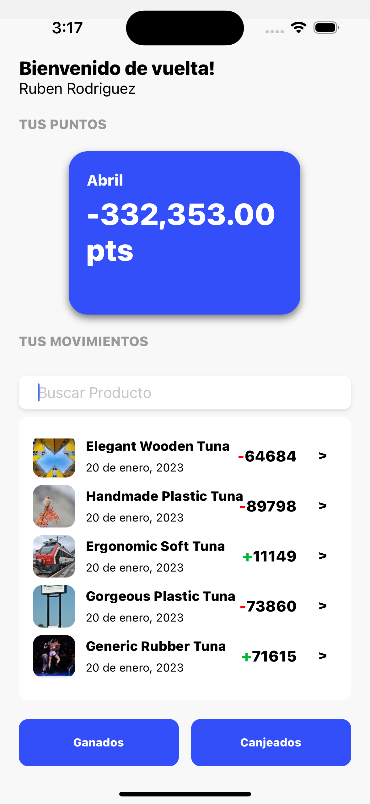
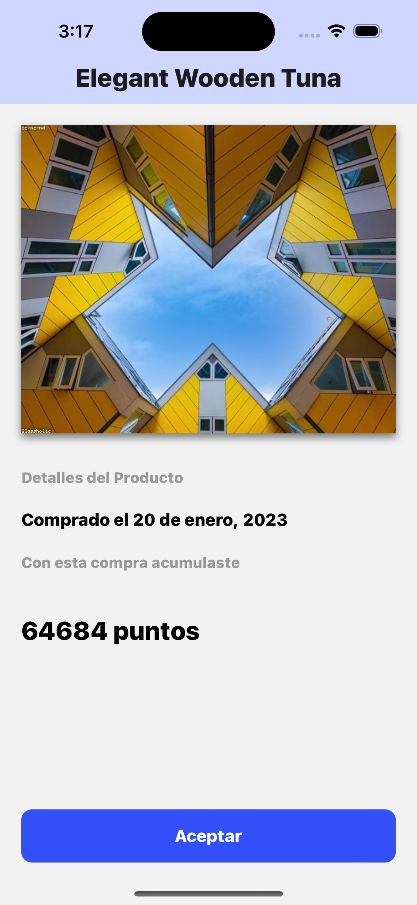

# Product Preview

Aplicación móvil desarrollada en React Native que permite a los usuarios visualizar las transacciones realizadas y el total de puntos generados con ellos. La aplicación muestra una lista de productos con información detallada sobre cada transacción realizada, incluyendo el tipo de transacción (ganado o canjeado), la fecha y la cantidad de puntos generados.

Adicional, la aplicación cuenta con una funcionalidad de filtrado que permite a los usuarios buscar productos por nombre y ver las transacciones relacionadas con ellos.

## Requerimientos

- Node.js (18.15.0)
- Xcode (14.2)

## Instalación

1. Clonar este repositorio:

  ```git clone https://github.com/AleexSolis/ProductPreview.git```

2. Instalar las dependencias del proyecto:

  ```
  cd ProductPreview
  npm install
  cd ios
  pod install
  ```

3. Probar el proyecto (opcional):

  ```npm run ios```

4. Correr el proyecto:

  ```npm run ios```

## Capturas de Pantalla


 
